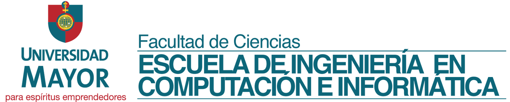
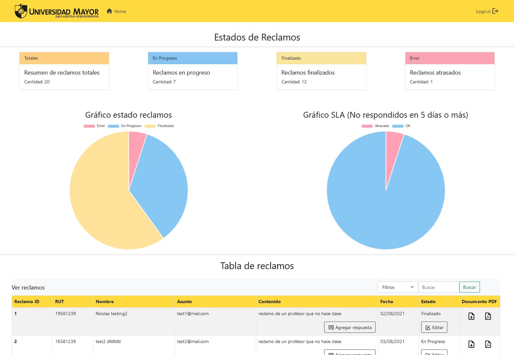
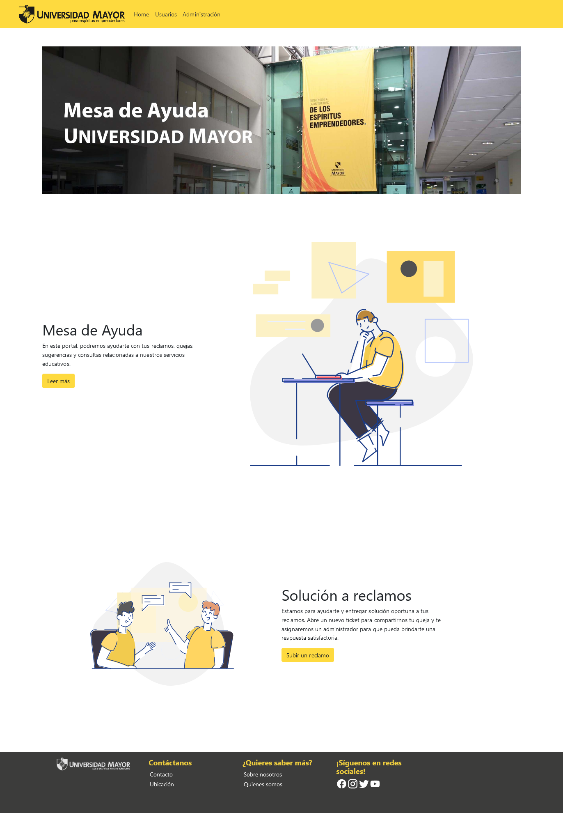

# umayor-web-reclamos

## Acerca de este repo


<p align="center">
  
</p>


Aplicación web desarrollada en Angular para la gestión de los reclamos recibidos en la Universidad Mayor, presentada a sus usuarios como una mesa de ayuda. Permite a sus usuarios enviar y consultar reclamos, y a los administradores responder y obtener estadísticas de los reclamos recibidos según su estado y fecha de cumplimiento.

Para la realización de este proyecto, desarrollado durante la asignatura *Arquitectura de desarrollo web*, utilizamos los lenguajes TypeScript, JavaScript, HTML y CSS, además de usar las librerías json-server, jsonwebtoken, chart.js, ng2-charts, jsPDF y más.


## Pasos para inicializar el proyecto
Dentro de la carpeta ```appreclamos```, ejecutar el siguiente comando la primera vez:
```
npm install
```
Después, y para todas las ocasiones siguientes, ejecutar cada uno de los siguientes comandos en ventanas distintas de una terminal:
```
json-server --watch db.json
ng serve --open
nodemon server.js
```

<p align="center">
  
</p>
